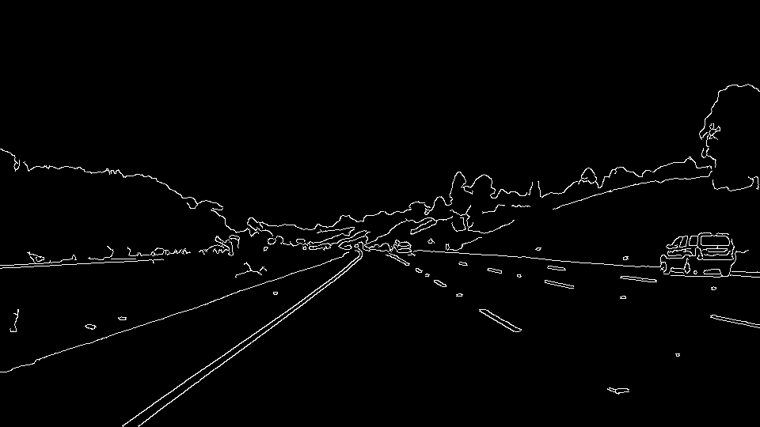
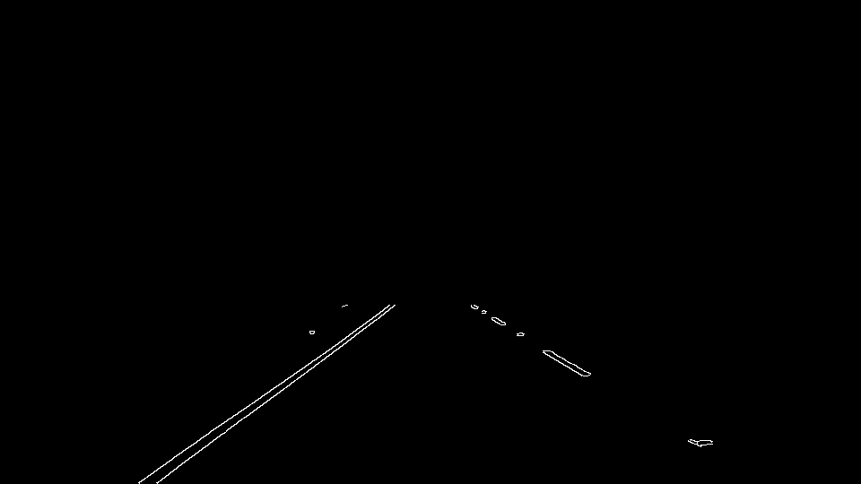
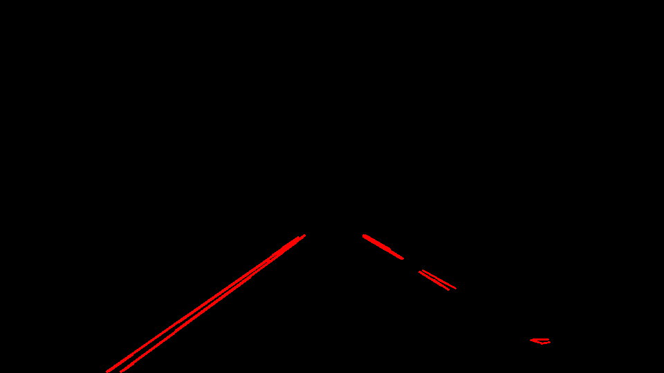
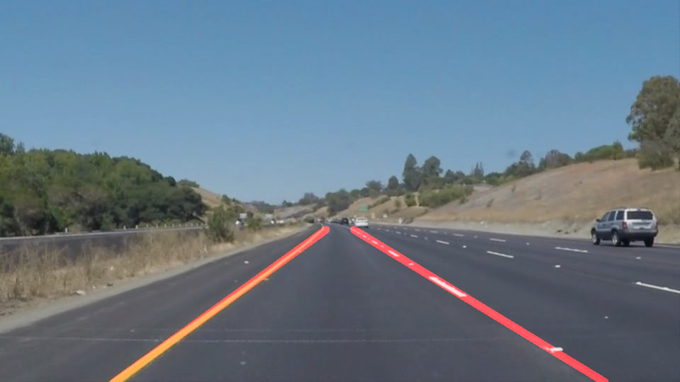
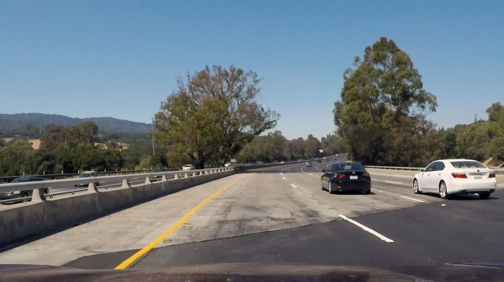
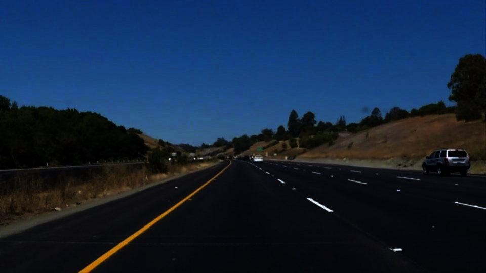
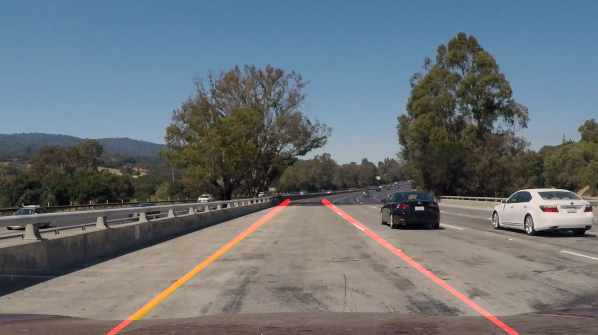

# **Finding Lane Lines on the Road** 

[//]: # (Image References)
[image1]: ./examples/grayscale.jpg
[original]: ./test_images/solidYellowCurve.jpg
[adjusted_gamma]: ./test_images/adjuste_gamma.jpg
[canny]: ./test_images/canny.jpg
[roi]: ./test_images/roi.jpg
[hough]: ./test_images/hough.jpg
[extrapolated_on_image]: ./test_images/extrapolated_on_image.jpg
[clear_patch]: ./test_images/challenge_shade_2.jpg
[adjusted_gamma]: ./test_images/adjusted_gamma.jpg
[extrapolated_on_image_gamma]: ./test_images/extrapolated_on_image_gamma.jpg

### 1. Pipeline description

Convert the image to grayscale, apply a Gaussian noise kernel, and the Canny edge detection algorithm, using a 3:1 threshold ratio:

Define a trapezoidal ROI to focus on the area of the image where the lanes are:

Apply the Hough transform to the ROI-bounded Canny edges, retrieving the detected segments.

In order to draw a single line for each lane, a second implementation for the `draw_lines()` function was created:  `draw_lines_extrapolated()`. In this function a certain Hough line is tagged as belonging to the left/right lane by checking the sign of its slope. Two additional checks are also performed, in order to avoid high leverage outliers:
+ Horizontal position of the line midpoint with respect to the ROI's top edge midpoint.
+ Slope is in a reasonable range (here 45º +- 20º).

After tagging the lines, a linear least squares fit is performed for each lane: collecting the coordinates of the Hough lines endpoints and regressing *x* against *y*:

#### Challenge case:
For the challenge case, the same pipeline is followed, just adding a step at the beginning.

The main obstacle in the challenge case is the patched interval of road halfway through the video.

The tarmac is so clear, the Canny-Hough tandem produces a noisy output and cannot distinguish the white and yellow lines clearly.

To overcome this, I apply a *gamma correction* (also known as Power Law Transform) in order to make the image darker and increase contrast.

Prepending this step to the default pipeline solves the issue on the light tarmac:

### 2. Potential shortcomings

The main problem of the pipeline overall is that it applies a transformation with given, static parameters to the whole sequence of frames. However, in the course of a route, lighting conditions and tarmac tonality vary, and the parameters to process a frame successfully may not be as successful for another.

Furthermore, all frames are treated as independent. This would mean, for instance, that if for any reason at a given frame a lane cannot be successfully detected, we cannot rely on any past instants to correct the position.

### 3. Possible improvements

The sensitivity of the pipeline versus severe variations in lighting conditions could be overcomed using more sophisticated image preprocessing transformations or implement rules to automatically tune parameters downstream based on image properties.

When it comes to taking into account temporal dependences between frames, to smooth the movement of the annotations (vibrations), and treat with missing measures, Kalman filtering could be a very good option.
